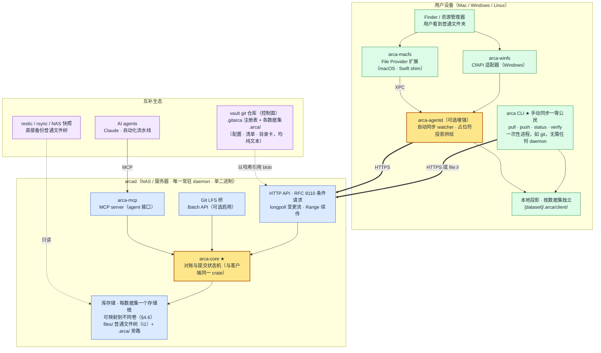
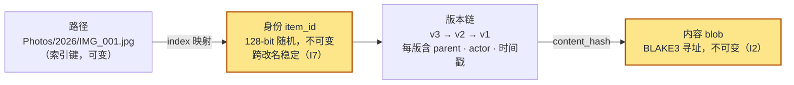
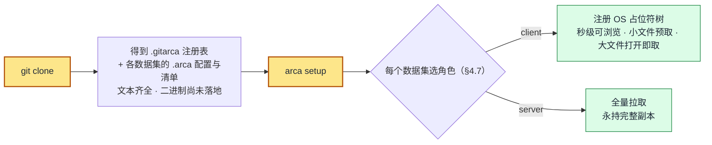
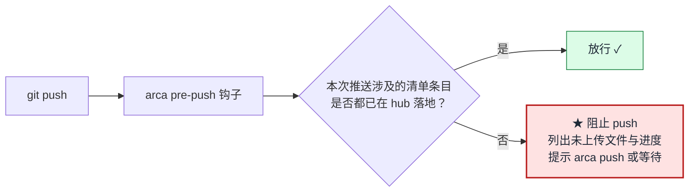
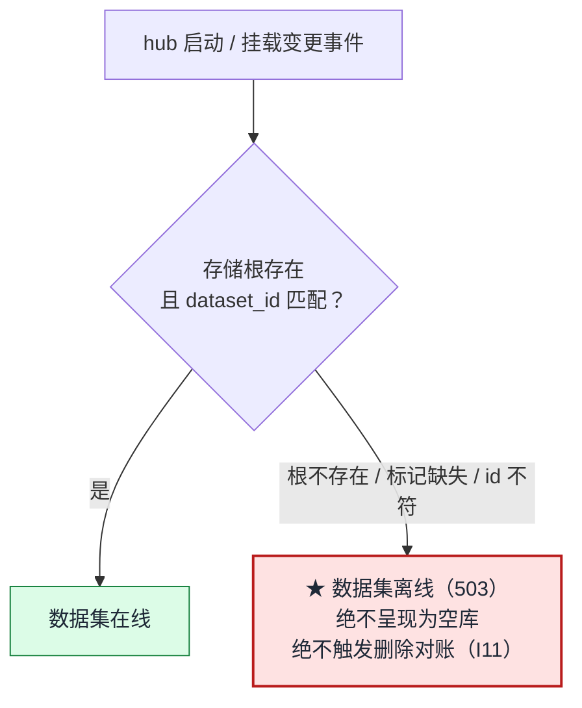
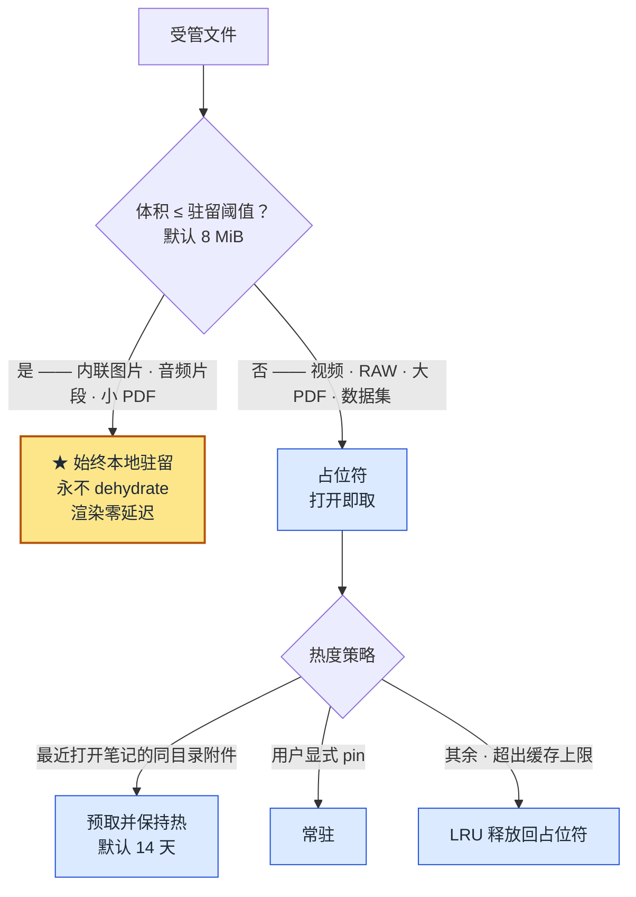
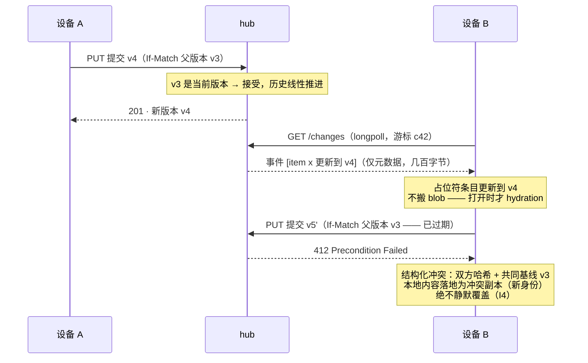
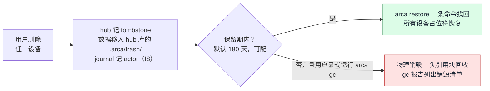
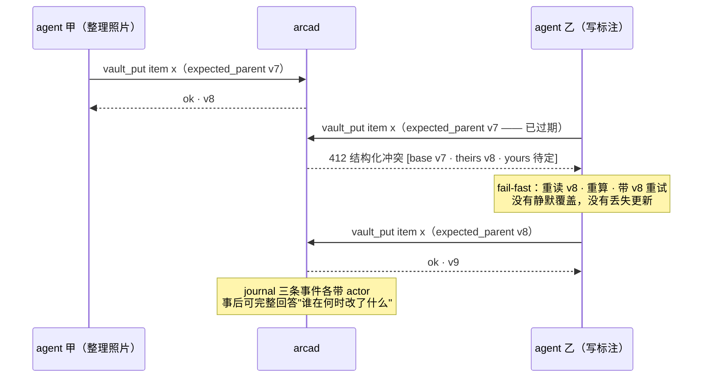

# arca 设计规格与开源项目规划（v1.1）

> **命名**：工作代号 arca（拉丁语"柜、方舟"）；当前倾向正式名 **`git-arca`**——  
> 遵循 `git-lfs` / `git-annex` 的既有命名传统，一眼说清"补充而非替代"，  
> 且 "git" 强前缀 + "arca" 弱噪音的组合搜索性极佳。CLI 双形态：独立 `arca …` 与子命令 `git arca …`。  
> 定名前仍需核查商标与 crates.io / GitHub org 占用（已知：裸 `arca` 在两处均被占用，`git-arca` 未见冲突）。  
> **官网域名已定：`gitarca.com`**——与 `git-arca` 的命名方向一致，是名称选择的一项既成约束。
>
> 本文承接 [DESIGN.CN.md](./DESIGN.CN.md)：继承 Lazync 的设计思想  
> （逃生舱、绝不猜测、防误删、内容寻址 CAS、崩溃一致性、端点无关身份），  
> 实现语言换为 Rust，定位从"文件同步"重构为：
>
> **git 仓库的二进制附件层——自托管、按相对路径原样可用。**  
> 笔记库（Obsidian 等）与团队仓库里的图片、视频、音频、电子书、设计稿、数据集：  
> 文本继续由 git 管理，二进制交给 arca，**但仍待在它们该在的相对路径上**；  
> 在 Mac / Windows 上是真文件（未下载者为 OS 占位符，如 iCloud），编辑器与构建脚本无需改造；  
> 多设备双向同步跑在元数据速率上；任何同步路径都无权销毁数据；  
> 对 AI agent 暴露条件写与审计接口——成为 agent 时代的私有数据底座。
>
> 图表使用 Mermaid；全文技术规范兼容目标见 §8 兼容矩阵。  
> 本版为经一致性评审后的定稿；自 v0.1 以来的演进摘要见文末「附录 A」。
>
> **术语约定（全文统一）**：  
> **vault** = 用户设备上的总目录（通常是 git 仓库），根部有唯一注册表 `.gitarca`；  
> **数据集（dataset）** = vault 内被 arca 管理、被 git 忽略的目录，自带 `.arca/` 元数据，  
> hub 侧对应一个存储根；**绑定（binding）** = 某设备对某数据集的一份副本，携带角色（server / client）；  
> **hub** = 承载数据集的自托管服务端。一个 vault 可引用多个 hub，但**每个数据集恰好属于一个 hub**。

---

## 0. 一句话定位与电梯陈述

**文本有 git，二进制没有。**arca **补上这一半——而且不动你的相对路径。**

- git 管**可变的文本**：笔记、源码、配置。
- arca 管**不可变的二进制**：图片、视频、音频、电子书、扫描件、设计稿、模型权重。
- 两者的接缝是**相对路径 + 内容哈希**：`![[assets/photo.png]]` 原样工作，  
  文本侧看到的永远是一个真文件，而不是指针、不是符号链接、不是 URL。

### 0.1 真正的痛点：笔记与仓库里的二进制附件

Obsidian、Logseq、Zettlr 这类工具的资料库天然适合 git——纯文本、可 diff、可回滚。  
但附件不适合：一张图、一段录音、一本 PDF 进了 git，仓库迅速膨胀且永不可瘦身。  
现有的几条出路各有致命伤——前三条的共同失败模式是**破坏了相对路径的可用性**，  
托管同步则败在所有权与可审计性：

| 方案 | 文本侧看到什么 | 致命伤 |
| --- | --- | --- |
| Git LFS | 几百字节的**文本指针文件**（`version https://git-lfs…`） | 未 `lfs pull` 时 Obsidian 渲染为破图；`.gitattributes` 之外的工具全都读到垃圾 |
| git-annex | **符号链接**指向 `.git/annex/objects/…` | 多数编辑器与跨平台（Windows）跟不动；UX 晦涩 |
| 对象存储 / 图床插件 | 一个 **URL** | 数据所有权丧失、链接会烂、离线不可用、无结构化归档 |
| Obsidian Sync 等托管同步 | 真文件 | 闭源、按容量收费、无自托管、无版本可审计 |
| arca | **真文件**（未下载时是 OS 占位符：正确路径、正确大小、正确元数据） | —— |

**这就是全部差异**：CfAPI / File Provider 占位符在应用眼中就是文件，  
所以 `![[photo.png]]` 照常渲染、构建脚本照常读取、`ls -l` 照常显示尺寸；  
只是 2 GB 的视频不占本地空间，点开才落地。  
指针文件与符号链接都做不到这一点——**这是操作系统级能力，不是 git 层能补的**。

同一机制直接迁移到团队仓库：设计稿、测试固件、数据集、演示视频按相对路径引用，  
`docs/arch.png`、`fixtures/sample.blend` 就在那儿，仓库却始终苗条。

### 0.2 与现有产品的差异

| 对比对象 | 它们 | arca |
| --- | --- | --- |
| Git LFS / git-annex | 模型对，但用指针/符号链接换取瘦身，破坏相对路径可用性 | OS 原生占位符：文本侧永远是真文件 |
| Dropbox / iCloud / Obsidian Sync | 托管在别人机器上，格式不可直读，无自托管 | 自托管，服务端就是普通文件树，随时可整体带走 |
| Syncthing / Nextcloud | 可变工作集的双向同步（最难的沼泽），全量占本地空间 | 二进制不可变语义：同步退化为元数据调和 + 按需水化 |
| 图床 / 对象存储插件 | URL 引用，链接会烂，离线不可用 | 相对路径引用，离线可用，所有权在自己手里 |

---

## 1. 目标与非目标

### 1.1 目标（按优先级）

1. **相对路径完整性**（首要目标）：被管理的二进制在**它原本的相对路径上**始终以真文件形态存在；  
   引用它的 markdown、代码、构建脚本无需任何改造，未安装 arca 的协作者拿到的也是可读的目录结构。
2. **OS 原生占位符体验**：受管目录在 Finder / 资源管理器中与普通目录无异；  
   未下载文件为占位符，打开时按需下载（hydration），按体积与热度分级驻留（§4.8）。
3. **安全的双向同步**：hub-and-spoke 拓扑 + 内容哈希 CAS；本地删除/改名可传播  
   （删除以 tombstone 表达，销毁只经显式 GC）。副本分角色：**server 角色永持全量、  
   client 角色用 OS 云文件占位**（§4.7）。
4. **逃生舱**：hub 上的库是普通文件树 + 旁路元数据目录；用 shell + coreutils 即可完整取回数据。
5. **git 互补，git 即控制面**：vault 本身是 git 仓库——根注册表 `.gitarca` 与各数据集自带的配置、清单、目录卡  
   随 git 在多端同步，受管二进制以**整目录**为单位被 `.gitignore`（§4.3）；  
   **克隆仓库 + `arca setup` 即完成新设备引导**。可选的 Git LFS 桥承接既有 LFS 仓库的迁移。
6. **归档语义的多设备库**：照片/电子书/扫描件等冷数据的采集、去重、校验、长期保存——  
   这是同一套机制的第二种用法（数据集不必依附于笔记库）。
7. **AI-native**：MCP server、每 agent 独立作用域令牌、If-Match 条件写、带 actor 的审计日志、  
   廉价快照——让多个 agent 能在同一库上安全并发协作。
8. **可发布**：每个数据集可配置公网 URL 前缀，笔记发布成网页时相对路径自动映射到 CDN，  
   且发布默认只导出被引用到的资源（§4.9）。
9. **弱硬件友好**：单二进制部署到 ARM NAS，内存占用平稳可预测。

### 1.2 非目标（v1 明确不做）

- ✗ 可变工作集的通用双向同步（不与 Syncthing / Dropbox 正面竞争；办公文档频繁并发编辑不是目标场景）
- ✗ 二进制内容合并（不可能做对；冲突 = 双版本并存 + 结构化上报）
- ✗ P2P mesh 与版本向量（拓扑固定为 hub-and-spoke，见 §5.1）
- ✗ E2EE / 不信任服务器模式（自托管前提下 hub 可信；列为 v2 议题）
- ✗ 照片浏览器、阅读器等媒体应用（生态在 catalog 与 API 之上做）
- ✗ **同一数据集**的跨 hub 复制 / 联邦（每个数据集恰好属于一个 hub；  
  vault 级的多 hub 已支持且互为独立故障域，见 §4.3.2。冗余靠备份与 server 副本，见 §4.5）
- ✗ 替代 Git LFS 成为 git 管道内的过滤器（v1 不做 clean/smudge filter——  
  寄生 git 管道正是 LFS 的失败根源；arca 与 git **并行**工作，只共享目录、`.gitignore` 与清单）
- ✗ **公开仓库中陌生人匿名 clone 即得全部资产**（二进制在 hub 上，需访问权；离线交付走 `arca bundle`，见 §4.4.3）
- ✗ 逐文件的归属规则（glob / 扩展名匹配）——归属只按目录声明（§4.3.1）
- ✗ **自动瘦身既有 git 历史**（`arca adopt` 只阻止未来膨胀；已提交的 blob 仍在历史里，瘦身需用户自行 `git filter-repo` 重写历史，arca 只提供指引不代劳）

---

## 2. 核心不变量（Invariants）

以下十条是协议级承诺，任何实现与演进不得违反。编号供全文引用。

| \# | 不变量 | 继承自 Lazync |
| --- | --- | --- |
| **I1** | **逃生舱**：hub 库的 `files/` 是普通文件树，逻辑路径与物理路径一一对应，无翻译层；删掉 arca，数据零成本可用 | §2 |
| **I2** | **blob 不可变**：任何修改产生新版本，绝不原地覆盖；版本以内容哈希标识 | §7（ETag） |
| **I3** | **同步路径无销毁权**：删除 = tombstone；物理销毁只经显式 GC / 保留策略，且 GC 绝不自动触发 | §6 强化 |
| **I4** | **一切写入走 CAS**：提交必须携带父版本哈希（If-Match 语义），过期即拒绝，绝不静默覆盖 | §7 |
| **I5** | **绝不猜测**：状态模糊 → 停下并可诊断，而不是尽力恢复 | §4 |
| **I6** | **不污染用户目录**：根目录只新增 `.gitarca` 与 `.gitignore` 中的一个标记块，每个数据集目录内只新增一个隐藏的 `.arca/`；受管文件**原地不动**——不改名、不移动、不换成指针或符号链接、不依赖扩展属性存关键状态 | §2/§12 |
| **I7** | **身份跨改名稳定**：路径是索引键，不是身份；版本历史跟随身份 | §3 |
| **I8** | **每个事件可归因**：journal 记录 actor（账号 + 设备/agent + 会话） | §5 扩展 |
| **I9** | **客户端可重建**：OS 占位符层与本地缓存都是投影（projection），可随时从 hub 全量重建；真相在 hub 的 journal 与库 | §8 认领机制扩展 |
| **I10** | **格式先于代码**：所有磁盘格式与线上协议版本化并公开文档化；只向前迁移，永不静默改格式 | §12 ③ |
| **I11** | **挂载缺失即离线**：存储根未挂载或卷身份标记不符 → 数据集离线并明确报错，绝不呈现为"空库"，绝不因此触发删除对账 | §6 + §11 精神在多卷场景的扩展 |

---

## 3. 系统架构



要点：

- **arca-core 是同一份对账状态机，两端共用**（继承 Lazync `shared/` 的纪律，§12 ②）：  
  客户端与 hub 对路径规则、哈希、过滤器、调和决策跑同一段代码。
- **真相在 hub**；客户端（含 OS 占位符层）全部是可重建投影（I9）。
- macOS 的 File Provider 扩展必须是 Swift/ObjC 进程，作为薄壳通过 XPC 调 Rust daemon；  
  Windows 的 CfAPI 可由 Rust（windows-rs）直接驱动。

### 3.1 运行形态：arcad 常驻，客户端手动优先（参考 git）

git 的形态是：**服务端有守护进程，客户端零常驻**——`git pull` 起一个进程、干完就退。  
arca 采用同一形态，全系统唯一的常驻进程是服务端的 **arcad**：

| 形态 | 进程 | 能力 | 类比 |
| --- | --- | --- | --- |
| **手动模式（基线，必须完整可用）** | 无常驻；`arca pull / push / status / verify` 一次性运行 | 全量或 pin 子集物化（无占位符）；按命令扫描与同步 | `git fetch / pull / push` |
| **自动增强（可选）** | arca-agentd | watcher 实时检测 + longpoll 自动同步 + 退避重试 | git 没有的部分 |
| **占位符增强（可选，依赖 agentd）** | arca-agentd + OS 适配层 | §6 的按需 hydration / 释放空间 | iCloud / OneDrive |

三条推论：

- **每层可独立降级**：agentd 崩了 → 手动命令照常工作；占位符注册失败 → 退回全量物化。  
  上层永远是下层的增强，不是依赖（I9 的进程版）。
- **Linux / CI / 服务器脚本天然只用手动模式**——无占位符 API 的平台不是二等公民，  
  而是最朴素形态的一等用户。
- **传输与对象模型分离**（git 的 transport 之道）：`https://`（经 arcad）之外，  
  v1 支持 **`file://` 直连**——dataset_root 所在卷本地挂载（NAS 直插、USB sneakernet）时，  
  无任何 daemon 也能完成同步，排他由 `arca.lock` 保证。`ssh://` 列 v2。  
  这让 M1 像早期 git：先有对象模型 + file:// 同步闭环，HTTP 只是之后加上的一种 transport。

### 3.2 CLI 纪律：plumbing / porcelain（继承 git 的分层）

git 最重要的架构决定之一：**一切能力先以输出稳定、可脚本化的 plumbing 命令存在**，  
porcelain 只是薄壳。arca 同样：

- **plumbing**：`arca ls --json`（清单/状态枚举）、`arca cat <hash>`（按哈希取内容）、  
  `arca resolve <path>`（路径 → 身份/版本）、`arca state dump --json`（投影检视——  
  SQLite 是二进制没关系，git 的 index 也是，前提是有 dump 命令）。  
  输出格式与退出码进 PROTOCOL.md，受兼容性承诺约束（I10）。
- **porcelain / MCP / GUI 都是 plumbing 之上的薄壳**——与「arca-core 可嵌入」（§11.3）同构。
- **Rule of Silence**：成功时安静；数据走 stdout，进度与诊断走 stderr；处处可加 `--json`。
- **动词与 git 心智对齐**（least surprise）：`status`（比对本地与 hub，不动数据）、  
  `fetch`（取远端元数据，不动工作区）、`pull`（fetch + 应用）、`push`（上传本地变更）、  
  `sync`（pull + push 的便捷 porcelain）。与 git 同名的动词语义必须一致；  
  一次性引导命令叫 `setup`（对齐 `git lfs install` 的角色）。
- **hooks 是机制不是策略**：pre-push（§4.4.2）之外预留 post-pull、pre-adopt、post-conflict  
  钩子点，生态按需挂接。

---

## 4. 数据模型、存储与拓扑

术语见文首约定（vault / 数据集 / 绑定 / hub）。本章自底向上：先讲单个数据集的数据模型  
与 hub 侧存储（§4.1–§4.2），再讲 vault 布局与 git 的接缝（§4.3–§4.4），  
最后是冗余、多卷、角色、驻留与发布（§4.5–§4.9）。

### 4.1 三层模型：身份 → 版本 → 内容



- `item_id`：随机 128-bit，创建时分配，永不复用。删除后重建同名文件 → 新身份（继承 Lazync §3 语义）。
- `version`：`{version_id, item_id, parent_version, content_hash, size, mtime, actor, committed_at}`。  
  版本链在 hub 上是**线性**的（hub-and-spoke 的红利，见 §5.1）；CAS 失败产生的分叉  
  以冲突副本（新身份）落地，不在链内。
- `content_hash`：**BLAKE3**（原生地址）。SHA-256 按需懒计算并缓存  
  （Git LFS 桥、Dropbox 导入校验需要，见 §8）。

### 4.2 hub 库磁盘布局

每个数据集对应一个独立存储根，不同数据集可映射到不同物理卷（§4.6）。单个存储根的布局：

```
dataset_root/                 ← hub 侧存储根（每数据集一个；此例为 photo 数据集）
├── files/                    ← I1 逃生舱：普通文件树，当前版本永远完整平放
│   └── 2026/IMG_001.jpg      ← 路径与 vault 内数据集相对路径一一对应
└── .arca/
    ├── format.json           ← 格式版本 + dataset_id 卷身份标记（I10、§4.6）
    ├── index/                ← 路径 → item_id 映射（继承 Lazync §3 的哈希索引键设计）
    ├── items/                ← item_id → 元数据 + 版本链（append-only 平文件）
    ├── chunks/               ← FastCDC 内容块（zstd 压缩，BLAKE3 寻址）
    │                            仅服务历史版本与增量传输；current 永远在 files/ 平放
    ├── journal/              ← append-only 事件流，含 actor（I8），epoch:seq 游标
    ├── trash/                ← tombstone 对象与保留期数据（I3）
    ├── uploads/              ← 断点续传会话（继承 Lazync §7 幂等五元组）
    ├── tmp/                  ← 写入暂存（tmp → fsync → rename 原子提交）
    └── locks/                ← arca.lock（OS 级排他锁）+ .txn 事务日志（继承 Lazync §4）
```

两条关键设计决策：

1. **current 平放、历史分块**。`files/` 下永远是完整普通文件（I1 不可谈判）；  
   CDC 分块只出现在 `.arca/chunks/`，用于：历史版本去重存储、修改文件的增量上传、  
   跨文件去重（同一张照片从两台设备导入只存一份历史块）。  
   这是对 Lazync「版本 = 全量副本」成本问题（DESIGN.CN.md §19.2）的正面回答，  
   同时不破坏逃生舱。
2. **元数据是平文件 + append-only**，与 Lazync 哲学一致：整库可用一次文件系统快照原子备份；  
   `chunks/` 的引用计数变更走 `.txn` 事务日志（继承 §4 前滚/回滚 +「绝不猜测」），  
   避免 Seafile 式离线 GC 的运维负担——GC 是显式命令 `arca gc`，且只清理超过保留期的 tombstone 与失引用块。

### 4.3 vault 布局：根注册表 + 自描述数据集

用户在每台设备上的入口是一个 **vault**，通常就是一个 git 仓库  
（纯归档、无 git 的场景布局完全相同，注册表文件名不变）。  
布局遵循两条原则：**根目录只放一个注册表文件，细节全部下沉到各数据集目录内部。**

```
vault/                          ← git 仓库（也可无 git，纯归档场景同样成立）
├── .git/
├── .gitignore                  ← arca 维护的标记块（见下）
├── .gitarca                    ← ★ 唯一的根文件：注册表（git 追踪）
├── notes/                      ← 普通 git 内容（纯文本，全部 git 追踪）
│   └── 京都行记.md              ← 内嵌 ![[assets/京都/鸭川.png]]
├── assets/                     ← ★ 数据集：整个目录归 arca
│   ├── .arca/                  ← 该数据集的自描述元数据
│   │   ├── dataset.toml        ← 身份 · hub 引用 · 发布配置（git 追踪）
│   │   ├── manifest            ← 文件清单（行式文本，git 追踪，§4.4.1）
│   │   ├── catalog/            ← 本数据集的目录卡（git 追踪，§4.4）
│   │   └── client/             ← 本地投影：角色 · 驻留策略 · 基线（gitignored，I9）
│   └── 京都/
│       ├── 鸭川.png             ← 受管（小图 → 始终本地驻留，§4.8）
│       └── 街景.mp4             ← 受管（大文件 → 占位符，打开即取）
├── photo/                      ← 另一个数据集（可指向另一个 hub）
│   └── .arca/…
└── books/
    └── .arca/…
```

#### 根注册表 `.gitarca`

只做两件事：**声明哪些目录归** arca，以及**登记可用的 hub 端点**。

```toml
# vault/.gitarca —— git 追踪；一屏内可读完，diff 一目了然
schema = 1

[hub.home]
instance_id = "3f2a…"                        # 稳定身份（继承 §11 端点无关）
url = "https://nas.example.com:8443"         # 只是"当前怎么连过去"

[hub.work]
instance_id = "8b1d…"
url = "https://vault.corp.example.com"

[[dataset]]
path = "assets"
hub  = "home"

[[dataset]]
path = "photo"
hub  = "home"

[[dataset]]
path = "confidential"
hub  = "work"        # ★ 同一仓库内不同目录挂到不同存储服务
```

#### 数据集自描述 `<dataset>/.arca/dataset.toml`

```toml
schema = 1
dataset_id = "9c41…"          # 全局唯一，不可变
hub_instance_id = "3f2a…"     # 认的是身份，不是 URL（§11）
public_base_url = "https://cdn.example.com/assets"   # 可选，发布用（§4.9）
url_style = "path"
```

#### 为什么这样切分

| 收益 | 说明 |
| --- | --- |
| **数据集可搬迁** | 目录带着 `.arca/` 一起 `mv` 到另一个仓库，身份、清单、目录卡、hub 归属全都跟着走，`arca adopt` 一步复位 |
| **一仓多存储** | 每个数据集独立指定 hub：笔记附件在家里 NAS、工作资料在公司服务器、图库在对象存储 |
| **独立故障域** | daemon 为每个数据集跑独立的调和回路；一个 hub 挂了，其余数据集照常工作（§4.3.2） |
| **git diff 局部化** | 改照片库只动 `photo/.arca/manifest`，不会和笔记附件的变更在同一文件里冲突 |
| **根目录干净** | 只有一个 `.gitarca`，代码审查时一眼看清"这个仓库把哪些目录交给了 arca" |
| **端点无关身份** | `dataset.toml` 认 `hub_instance_id`，`.gitarca` 才存 URL——换域名、LAN/WAN 切换只改注册表一处（继承 §11） |

#### `.gitignore`：必须用反选写法

数据集目录整体被忽略，但目录内的 `.arca/` 必须被 git 追踪——  
git 的规则是"父目录被排除后，其内容无法再被反选"，因此**不能**直接写 `/assets/`，  
而要排除其内容再反选 `.arca/`：

```gitignore
# >>> arca managed (do not edit inside) >>>
/assets/*
!/assets/.arca/
/assets/.arca/client/
/photo/*
!/photo/.arca/
/photo/.arca/client/
# <<< arca managed <<<
```

这段由 arca 生成与维护，幂等、可人工审阅、可随手删除。  
**`arca doctor` 必须把这段模式的正确性作为一项断言**——写错一个字符，  
要么 `.arca/` 元数据没进 git（协作者拿不到清单），要么整个数据集被误提交进 git（仓库爆炸）。  
这是本设计里最容易出错、也最必须被测试覆盖的一处（§6.3 第 9 条）。

#### `git clone` 后会发生什么

因为 `<dataset>/.arca/` 是 git 追踪的，clone 之后**数据集目录会自动出现，且自带完整清单**：

```
assets/
└── .arca/
    ├── dataset.toml
    └── manifest          ← 缺哪些文件、多大、哈希是什么，全在这儿
```

于是 `arca setup` 不需要任何额外配置——读 `.gitarca` 找到数据集，  
读各自的 `dataset.toml` 找到 hub，读 `manifest` 知道该补什么。  
**没装** arca **的人**也能直接打开这两个文件看懂缺了什么（§4.4.1）。

### 4.3.1 为什么只做目录级：一条刻意的简化

早期草案曾设计过 glob 规则型数据集（`**/*.png` 这类），以适配 Obsidian  
"附件放在笔记旁边"的习惯。**v0.3 明确放弃这个方向**——它把一条清晰的边界换成了一堆判断：

| glob 方案会引入 | 目录方案的结果 |
| --- | --- |
| 逐文件判断归属：这张图归 git 还是归 arca？ | 看它在哪个目录，一眼定论 |
| 双重管理危险：已被 git 追踪的文件又被规则命中（`.gitignore` 对已追踪文件无效） | 结构上不可能发生 |
| 需要 exclude 列表、体积下限等启发式来防误纳管 | 不需要任何启发式 |
| 规则演进的语义（新增/移出 include 各意味着什么）需要专门定义 | 增删一个目录声明即可，语义自明 |
| 数据集与 hub 存储根/物理卷（§4.6）无法一一对应 | **数据集 = 目录 = hub 存储根 = 可挂载卷**，全链路同构 |
| 缺文件时，缺口散落在几百个笔记文件夹里 | 缺口就是一个目录，可读性强（§4.4.1） |
| 发布成网页时无公共前缀可映射到 CDN | **一个数据集 = 一个 URL 前缀**，纯字符串替换（§4.9） |

这与全项目的「绝不猜测」（I5）一致：**归属是声明出来的，不是匹配出来的。**

**代价必须诚实说明**：使用"附件与笔记同级 / 同名子文件夹"的 Obsidian 用户需要改一次设置  
（设置 → 文件与链接 → 新附件的默认位置 → 指定文件夹，如 `assets/`），并把既有附件迁入该目录。  
**在 Obsidian 内部移动文件会自动更新链接**，社区也有批量整理插件，  
所以这是一次性的、有工具支持的迁移；`arca init` 会检测这种布局并给出明确指引，  
但**绝不自动搬动用户的文件**（I6）。团队仓库通常本来就是目录组织的  
（`docs/images/`、`fixtures/`、`assets/`），基本无迁移成本。

> 若未来社区强烈需要 glob，可作为 v2 的**受限扩展**重新评估——  
> 前提是先用可执行的检查把"双重管理"彻底堵死，而不是靠文档提醒。

**什么进 git、什么留本地**——共享的是声明，本地化的是设备差异：

| 内容 | 位置 | git | 说明 |
| --- | --- | --- | --- |
| 注册表（哪些目录受管、hub 端点） | `/.gitarca` | ✓ | 根目录唯一新增文件 |
| 数据集身份与发布配置 | `<ds>/.arca/dataset.toml` | ✓ | 自描述，随目录搬迁 |
| 文件清单 | `<ds>/.arca/manifest`（行式） | ✓ | §4.4.1 |
| 目录卡 | `<ds>/.arca/catalog/` | ✓ | 可 diff / merge / 回滚 |
| `.gitignore` 的 arca 标记块 | `/.gitignore` | ✓ | arca 写入维护，幂等，含反选写法 |
| 受管二进制本体 | `<ds>/**` | ✗ | arca 数据面 |
| 角色 · 驻留策略 · 基线 | `<ds>/.arca/client/` | ✗ | 设备差异不进共享配置 |

**新设备引导 = git clone + arca setup**（对齐 `git lfs install` 的模式）：



**未安装** arca**、或没有 hub 访问权的协作者**克隆仓库后，看到的是完整的文本、  
**空的数据集目录**，以及一份完整的清单（§4.4.1）——不是破图指针、不是死链，  
而是一个可读的缺口：缺哪些文件、多大、哈希是什么、如何补齐，全都写着。  
目录级归属让这个缺口更整齐：**缺的是一个目录，而不是散落在几百处的破图。**  
这比 Git LFS 的"内容是一段陌生文本"在可诊断性上强一个量级。

- 客户端状态用 SQLite 而非平文件：它是**可抛弃投影**（I9），逃生舱承诺只约束 hub；  
  行业经验（OneDrive Reset、Dropbox 旧引擎）表明客户端库必须假设会损坏，  
  因此「删掉重建」是一等公民操作：`arca rebuild` 从 hub 全量对账重建，  
  内容一致的本地文件走认领（adopt）零传输接管（继承 §8）。
- vault 侧的 `.arca/`（控制面 + 投影）与 hub 侧库根的 `.arca/`（元数据旁路）结构不同、  
  由 `root.meta` 的三元组区分，`arca setup` 会拒绝把一个 hub 库根当作 vault 绑定，反之亦然。

### 4.3.2 一致性规则与多 hub 处理

两处声明并存就会有不一致的可能，按「绝不猜测」（I5）处理：

| 情形 | 处置 |
| --- | --- |
| 目录有 `.arca/` 但不在 `.gitarca` 注册表中 | **孤儿数据集**：报告并**拒绝同步**，等待用户显式 `arca register`。防止从别处拷来的目录静默激活 |
| `.gitarca` 有条目但目录不存在 | clone 后的正常态之一 → `arca setup` 时创建；若 `dataset.toml` 也缺失则报错 |
| `dataset.toml` 的 `hub_instance_id` 与注册表中该 hub 名的 `instance_id` 不符 | **拒绝同步**并报告——这正是 §11 防误绑三元组要拦住的场景 |
| 数据集目录嵌套（一个数据集在另一个数据集内部） | **拒绝**：`arca doctor` 报错。归属必须唯一 |
| 同一路径被登记两次 | 拒绝 |

**多 hub 的运行语义**：daemon 为每个数据集维护独立的绑定、独立的 journal 游标、  
独立的传输队列与退避状态。一个 hub 不可达时，只有它承载的数据集进入离线态（I11），  
其余数据集完全不受影响——`arca status` 按数据集分别报告健康度。


### 4.4 catalog：可变元数据放 git（互补的具体形态）

```
photo/.arca/catalog/          ← 每个数据集自带一份，随 git 追踪（§4.3）
├── albums/2026-春-京都.toml   ← 相册：成员以 item_id + content_hash 引用
├── tags.toml                 ← 标签体系
├── items/3f/3f2a….toml       ← 每条目卡片：EXIF 摘要 · 标题 · 备注 · 自定义字段
└── embeddings.lock.toml      ← 向量索引清单：embedding 文件本身是受管 blob，按哈希引用
```

- catalog 是**纯文本、人可编辑、git 可 diff/merge/回滚**——用户的整理历史获得 git 的全部能力。
- catalog 永不内嵌二进制；一切二进制以 `blake3:…` 哈希引用数据集中的 blob。
- `arca catalog sync` 双向校验 catalog ↔ 数据集的引用完整性（悬空引用报告，绝不静默删）。
- **catalog 的格式属于规范，实现移出核心**：由独立工具 `arca-catalog` 读写（do one thing well——  
  核心是 stupid binary tracker，不内置相册；git 也不内置 bug tracker）。核心只保证引用完整性可校验。
- catalog 与它描述的数据集同处一个目录树，因此**数据集搬迁时目录卡自动跟随**（§4.3）。  
  跨数据集的合集（一个相册引用两个数据集的照片）为 v2 议题。
- Agent 场景：embedding / 标注 / 描述由 agent 写入 catalog（走 git）与数据集（走 CAS），  
  两侧都天然可审计、可回滚。

### 4.4.1 清单（manifest）：git 侧的二进制影子

**文本走 git remote、二进制走 arca hub，这是两条通道**——这是"不把二进制塞进 git 对象库"  
的必然结果，Git LFS 与 git-annex 同样如此。关键不在于消除它，而在于**让缺口可读**。

为此，每个受管文件在 git 里都有一条清单记录：

```
assets/.arca/manifest          ← 与数据集同处一处，随 git 同步
```

**格式刻意选择行式而非 TOML**——一行一条、按路径字节序排序、Tab 分隔、确定性序列化：

```
#%arca-manifest v1
京都/街景.mp4	blake3:c71a…	1884301776	2026-08-04T10:23:02Z
京都/鸭川.png	blake3:9f2c…	2411008	2026-08-04T10:22:31Z
```

理由来自 git 自身的实践：`.gitignore` / `.gitattributes` 全是行式，因为**有序行式文本  
是 git 三方合并最友好的形态**——两个人各自添加文件后合并，diff 是两行插入，几乎不冲突；  
若用 TOML 表结构，同样的操作大概率产生手工冲突。排序保证序列化确定（同内容必同字节），  
Tab 无歧义（Tab 与换行本就被路径规则禁止，继承 Lazync §12）。

它带来四件事：

1. **协作者即使没装** arca，clone 后看到的不是"图片神秘消失"，而是一份精确的缺失清单  
   （路径、大小、哈希）与补齐指引。
2. `arca doctor` 能报"缺 12 个文件、共 3.2 GB，运行 `arca pull`"。
3. **git 的历史天然覆盖二进制的存在性**：`git log` 能回答"这张图是哪次提交引入的"，  
   `git checkout` 旧提交后 arca 按当时的清单还原对应版本——**二进制由此获得了 git 的时间轴**。
4. **hub 消失后的兜底**：手里仍有完整的路径 + 哈希清单，从任何备份里找回的文件都能验证并复位。

> 这正是 Git LFS 指针文件的**情报价值**，但不放在文件本该在的位置上。  
> LFS 的错误不是记录了 oid，而是把 oid 塞进了渲染器要读的那个字节流里（§0.1）。

### 4.4.2 pre-push 一致性钩子：防悬空引用

`git push` 与 arca 上传不是原子的：笔记提交推上去了、图还在上传队列里，  
队友这时 pull 就会拿到悬空引用。解法沿用 Git LFS 的成熟做法——**pre-push 钩子**：



钩子由 `arca init` 安装（可拒绝，可用 `--no-verify` 绕过），且**只读不改**：  
它从不修改提交、从不自动 push，只做一致性断言——符合「绝不猜测」。

### 4.4.3 `arca bundle`：给拿不到 hub 的人

面向不装 arca、也无 hub 访问权的接收方（外部评审、邮件交付、长期离线归档）：

```bash
arca bundle --at HEAD --out kyoto-notes.arcabundle
```

产出一个自包含归档：某个提交所引用的全部二进制 + 清单 + 校验和。  
对方解包即得到完整目录结构，无需 hub、无需安装 arca。  
`arca bundle --verify` 可离线校验完整性。

**边界声明**：由此可见，arca 适用于个人库与私有/团队仓库；  
**公开仓库中陌生人匿名 clone 即得全部资产**不是 v1 的目标场景（§1.2）——  
诚实写明边界，优于让用户在协作现场才发现。

### 4.5 备份与冗余模型

一个数据集恰好属于一个 hub（跨 hub 复制/联邦见 §1.2 非目标）。  
数据集的冗余 = **hub 库的平文件快照备份**（restic / rsync / ZFS·btrfs 快照 / NAS 自带备份，  
I1 保证这些工具直接可用）+ **任意数量的 server 角色全量副本**（§4.7）+ 客户端 pin 策略形成的自然多副本。  
`arca status` 报告每个数据集的 server 副本数，低于阈值（默认 2）即告警——致敬 git-annex 的 numcopies。  
`arca verify --all` 做全库 fixity 巡检（逐文件 BLAKE3 重算对账），  
输出机器可读报告——归档产品的"体检报告"，防 bit rot 的最后防线。

### 4.6 hub 多卷映射与卷身份（I11）

hub 允许把多个数据集映射到不同的物理卷——外置硬盘、不同挂载点均可：

```toml
# hub 侧 hub.toml（hub 本机配置，不进 vault 仓库）
[dataset.photo]                 # 键名仅为 hub 本机助记；关联认 dataset_id（见下）
root = "/Volumes/disk1/arca-photo"

[dataset.books]
root = "/mnt/disk2/arca-books"
```

卷是会消失的：外置盘被拔掉、挂载失败、盘符/挂载点漂移。  
因此每个存储根携带**卷身份标记**——`.arca/format.json` 中记录它承载的 `dataset_id`，  
必须与 hub 配置及客户端绑定请求三方一致（存储根的卷身份 = 数据集身份，不引入第二套 ID）：



这是「绝不猜测」（I5）在多卷场景的关键应用：**未挂载的卷与空库在字节上难以区分，语义上天差地别**。  
把前者当后者，正是 DESIGN.CN.md §17.2 ② 那类静默误删事故的多卷变体。  
客户端对应行为：数据集离线 → 四道闸门的单点确认收到错误而非 404 → 一个本地文件都不会被删。

### 4.7 副本角色：server 与 client

同一数据集的每个绑定携带一个角色，决定其存储行为：

|  | **server 角色** | **client 角色** |
| --- | --- | --- |
| 数据形态 | 永持全量普通文件，无占位符 | OS 云文件占位符（§6），打开按需 hydration |
| 释放空间 | **永不**——不参与任何 dehydrate / evict / 云侧空间语义 | pin 策略 + LRU 自动释放 |
| 远端 tombstone | 数据移入本地 trash 保留期，物理销毁只经显式 GC（I3） | 四道闸门通过后移除本地副本/占位符 |
| 典型载体 | hub 存储根（天然 server）、外置大盘、第二台常开机器 | 笔记本、台式机的日常使用 |
| 冗余贡献 | 计入 server 副本数（§4.5 告警阈值） | 不计入 |

- **角色是设备本地决策**（存 `<dataset>/.arca/client/`，不进 git）：同一台机器可以对 `photo` 是 client、对 `books` 是 server。
- hub 自己的存储根即隐式 server 角色。
- 一句话语义：**server 承诺"本地永远有完整数据，任何云侧语义都不会缩减它"；  
  client 把本地视为可再生缓存。** 归档产品的信任模型由此闭合：  
  只要任一 server 副本存活，数据就在自己手里。

### 4.8 分级驻留策略：防 hydration 风暴

client 角色若把所有文件都做成占位符，会在真实工作流里立刻翻车：

- 一篇内嵌 30 张图的笔记，Obsidian 渲染时逐个读取 → 30 次阻塞式网络拉取，体验灾难；
- 编辑器的全库索引、搜索、备份工具、杀毒软件扫描 → 可能触发**全库水化**，  
  瞬间拉爆磁盘与带宽（这是 OneDrive / iCloud 用户反复投诉的真实故障模式）。

因此**默认策略不是"一律占位"，而是按体积与热度分级**：



三条实现要求：

1. **驻留阈值可配、默认 8 MiB**——足以覆盖几乎全部内联图片与音频，  
   使"笔记渲染永不等待网络"成为默认体验；同时 2 GB 的视频仍不占空间。
2. **区分元数据读与内容读**。索引器、缩略图服务、备份工具通常只 stat 或读文件头。  
   Windows CfAPI 支持按区间响应 `FETCH_DATA`，可只喂前若干字节而不整文件水化；  
   macOS File Provider 控制力较弱，需实测哪些访问模式会触发全量拉取。  
   **"全库索引不触发水化"必须作为一条自动化测试**（§6.3）。
3. **水化并发上限 + 批量合并**：短时间内的大量水化请求排队合并，  
   避免把 NAS 上行打满；同时向 OS 报告进度，让 Finder / 资源管理器显示正常的下载指示。

> 设计立场：**占位符是给"大而冷"的文件用的，不是给所有文件用的。**  
> 这一条把 iCloud 式体验的最大失败模式挡在门外。


### 4.9 发布与公开 URL 映射

用户把 vault 里的 md 发布成网页时，笔记里的相对路径引用需要变成公网 URL。  
**目录级数据集让这件事退化为一次纯前缀替换**：

```
vault 中：  assets/京都/鸭川.png
发布后：    https://cdn.example.com/assets/京都/鸭川.png
```

配置写在数据集自己的 `<dataset>/.arca/dataset.toml` 里（`public_base_url` 与 `url_style`），  
因此**发布配置随数据集搬迁**，且不同数据集可以指向完全不同的 CDN 或对象存储。

#### 四条设计约束

**① 替换只发生在发布时，绝不改写 vault 里的 md。**  
用户的笔记永远保持相对路径——这是 I6 与整个定位的根基。arca 只产出映射，重写由站点生成器完成：

```bash
arca publish-map --out publish-map.json
```

```json
{
  "schema": 1,
  "datasets": {
    "assets": { "prefix": "assets/", "base_url": "https://cdn.example.com/assets", "style": "path" },
    "photo":  { "prefix": "photo/",  "base_url": "https://r2.example.com/photo",   "style": "hash" }
  },
  "items": { "assets/京都/鸭川.png": { "hash": "blake3:9f2c…", "size": 2411008 } }
}
```

Hugo / Eleventy / Quartz / Zola 等只需一个几十行的过滤器消费它；  
官方仓库提供参考实现，但**核心不绑定任何站点生成器**。

**② 两种 URL 风格，各有适用面。**

|  | `path` | `hash` |
| --- | --- | --- |
| 形态 | `{base}/京都/鸭川.png` | `{base}/blake3/9f2c…` |
| 可读性 / SEO | 好 | 无 |
| 缓存 | 改名或换图会失效 | **blob 不可变（I2）→ `Cache-Control: immutable, max-age=31536000` 永不失效** |
| 改名影响 | 链接变动 | 链接不变 |
| 目录结构泄露 | 会 | 不会 |

建议：笔记站点用 `path`，图库/归档与 CDN 场景用 `hash`。

**③ 默认只发布被引用的资源。**  
直接公开整个数据集会暴露没被任何已发布笔记引用的文件——这是隐私事故的常见来源。

```bash
arca publish --referenced-only   # 默认：扫描待发布 md，只导出被引用到的 blob
arca publish --all               # 全量公开，必须显式指定
```

这是「绝不猜测」在发布路径上的对应物：**扩大暴露面必须是显式动作。**

**④ 两种承载方式，用户自选。**

- **hub 直供**：hub 为数据集开一个只读公开端点（可匿名或带 token），前面挂 CDN。省事，流量走自己的线路。
- **导出到静态托管**：`arca export --public --to s3://…`（或 R2 / 任意静态托管），  
  把副本推过去。省带宽，且 hub 不必对公网暴露。

#### 一个意外红利：CI 不下载二进制也能构建站点

因为清单（§4.4.1）里已有路径、哈希、大小，而链接重写只需要这三样——  
**构建机可以在不拉取任何 blob 的情况下生成完整站点**。  
100 GB 的图库，CI 一个字节都不用下载。这是清单设计的副产品，也是相对于  
"把二进制塞进仓库"方案的一个决定性效率差异。

> v2 议题：签名 URL（半公开分享、限时链接）、按 dataset 的访问日志与配额。

---

## 5. 同步协议

### 5.1 拓扑决策：hub-and-spoke + 线性历史

双向同步有两个难度档位：P2P mesh 需要版本向量与全网索引交换（Syncthing 之路）；  
**中心 hub 让每个 item 的历史在 hub 上线性化**，客户端只需三态对账 + CAS。  
arca 选后者——NAS 本来就是自托管场景的物理中心，这个约束免费。  
注意 hub-and-spoke 以**数据集**为单位成立：每个数据集恰好一个 hub、一条线性历史；  
一个 vault 可含多个数据集、指向多个 hub，彼此独立（§4.3.2），互不构成 mesh。



### 5.2 变更传播（继承并升级 Lazync §5）

- journal：append-only、`epoch:seq` 游标、压缩后 `reset_required` 全量对账兜底——全套继承。
- 轮询升级为 **longpoll**（对齐 Dropbox `list_folder/longpoll` 语义）：客户端挂起 30–90 秒，  
  有事件立即返回；SSE 作为 agent 场景的推送通道。2 秒短轮询仅作降级路径。
- 客户端变更检测三重保险继承 Lazync §5：实时事件（Windows `ReadDirectoryChangesW` /  
  macOS FSEvents）→ 溢出即全扫 → 周期性全量对账地基。**三重保险属于 agentd 自动模式**；  
  手动模式（§3.1）在命令执行时做一次全量扫描对账——正确性同源，只是触发时机不同。

### 5.3 删除与改名：补上 Lazync 的半双工缺口

tombstone 语义（I3）使双向传播变得安全：

| 操作 | 传播行为 | 安全根据 |
| --- | --- | --- |
| 本地删除 | → hub 记 tombstone，进入 `.arca/trash/` 保留期；其他设备移除占位符 | 无销毁：保留期内 `arca restore` 一条命令找回 |
| 本地改名/移动 | → 身份不动、映射搬家（继承 §3 三步原子改名） | 版本历史自动跟随 |
| 远端 tombstone 到达本地 | 四道闸门（继承 §6：read_roots 范围 → 单点确认 → 基线一致性）通过后，仅移除本地副本/占位符 | 本地有未同步修改 → 升级为冲突副本，不删 |
| 冲突 | 双版本并存：本地内容 → 冲突副本（新身份），命名 `原名 (设备名 的冲突副本 2026-08-04).ext`（对齐 Dropbox 惯例）；同时产出结构化冲突事件供 agent/UI 消费 | 绝不合并二进制（非目标 §1.2） |

表中"远端 tombstone 到达本地"描述的是 **client 角色**；server 角色的处理见 §4.7——  
只移入本地 trash 保留期，任何云侧语义都不会缩减 server 副本的数据。

**跨数据集移动不保持身份**：把文件从 `assets/` 挪进 `photo/`（或挪入/挪出 git 区）  
= 源数据集记 tombstone + 目标侧按新文件纳管（内容哈希相同则零传输）。  
身份（item_id）的作用域是单个数据集——这是目录级归属的自然边界，也与「删除后重建 = 新身份」同构。

### 5.4 传输（继承 Lazync §7，增量化）

- 上传：分块断点续传、幂等五元组、丢失 commit 的 no-op 恢复——全套继承。  
  新增：**修改过的文件只传变化的 CDC 块**（FastCDC 切块，BLAKE3 索引，hub 已有的块跳过）。
- 下载：Range + If-Match 版本钉住 + `.part` 按内容哈希命名 + 原子安装——全套继承。
- 上传前两轮稳定性签名防抖（继承 §8）：相机/扫描仪写入一半的文件绝不入队。

---

## 6. 占位符层（OS 集成）

本章仅适用于 **client 角色**的绑定，且需要可选的 arca-agentd 常驻（§3.1）；  
server 角色永持全量普通文件，不经过占位符层（§4.7）；手动模式下 client 角色以全量或 pin 子集物化。

### 6.1 三态模型与 pin 策略


状态语义对齐 OneDrive（online-only / locally available / always available），用户零学习成本。  
驻留策略由 §4.8 的分级规则驱动，用户可覆盖：`体积 ≤ 8 MiB 始终驻留`（默认）、  
`最近 90 天自动保留本地`、`此相册钉在这台设备`、`本设备总缓存上限 50 GB（LRU 释放）`——  
策略存客户端投影，按设备独立，不进 git。

### 6.2 平台适配

|  | Windows | macOS |
| --- | --- | --- |
| API | **Cloud Files API**（CfAPI，`cldflt.sys` 微过滤驱动，Win10 1709+） | **File Provider**（`NSFileProviderReplicatedExtension`，macOS 12+） |
| 注册 | `CfRegisterSyncRoot` + `CfCreatePlaceholders` | NSFileProviderDomain，出现在 `~/Library/CloudStorage/` 与边栏 |
| 按需下载 | `FETCH_DATA` 回调 → daemon 流式喂数据 | `fetchContents(for:)` → XPC 调 daemon |
| 释放空间 | 置 dehydrate / UNPINNED 属性 | `evictItem(identifier:)` |
| 限制 | 仅 NTFS | 扩展必须 Swift/ObjC 沙箱进程；`fileproviderd` 调度是黑盒 |
| 落地形态 | Rust 直接驱动（windows-rs） | Swift 薄壳 + XPC → Rust daemon |

工程纪律（对应 I9）：**OS 占位符状态永远是投影**。daemon 的 journal 才是真相；  
适配层任何异常（Windows 同步根损坏、macOS 域失效）标准处置都是注销域 → 重建 → 全量对账 + adopt 认领，  
用户数据与钉住策略不受影响。这条路径要作为一等公民测试，而不是灾难恢复文档里的脚注。

### 6.3 必测的噩梦路径

1. 未下载目录的整体改名/移动（占位符树与身份映射同时变）
2. 离线修改 + 重连（基线对账 + CAS 提交 + 可能的冲突副本）
3. hydration 进行中文件被编辑 / 被释放空间
4. 占位层与真相层不一致（投影重建演练，注入式测试）
5. 同一文件在 A 设备改名、B 设备编辑（改名与新版本在 hub 汇合）
6. Linux 客户端（无占位符 API）：以 server 角色（全量）或 headless pin 子集方式运行（§4.7）
7. **★ 全库索引不触发水化**：模拟 Obsidian 启动索引 / Spotlight / Windows Search /  
   备份工具 / 杀毒扫描遍历全库，断言水化字节数为 0（§4.8 要求 2）
8. **★ 笔记打开风暴**：一次性打开内嵌 30 张图 + 3 段视频的笔记，  
   断言小图零延迟（已驻留）、视频按需且并发受控，UI 不阻塞
9. **★ `.gitignore` 反选写法正确性**（本设计最易出错处，§4.3）：断言 `<ds>/.arca/dataset.toml`  
   与 `manifest` **被 git 追踪**、`<ds>/.arca/client/` 与受管二进制**未被追踪**；  
   并验证 `git checkout` 切分支、`git clean -xdf`、`git stash` 不误伤受管二进制
10. **★ 清单与实体一致性**：`git checkout` 到旧提交后，arca 按当时清单还原对应版本；  
   pre-push 钩子在二进制未上传完成时正确阻止推送（§4.4.1、§4.4.2）
11. **★ 多 hub 故障隔离**：仓库内两个数据集分属两个 hub，断开其一 →  
   该数据集离线（I11）、另一个照常同步、`arca status` 分别正确报告（§4.3.2）
12. **数据集搬迁**：把 `photo/`（含 `.arca/`）整体移到另一个仓库，`arca adopt` 后  
   身份、清单、目录卡、hub 归属全部复位，零重传（§4.3）

---

## 7. 删除、保留与 GC



- GC **只能显式触发**（I3）：cron 里写 `arca gc` 是用户的主动决策，默认安装不销毁任何东西。
- `arca gc --dry-run` 先出清单；gc 与 fsck 共享引用计数校验，发现悬空/多余引用 → 停下报告（I5）。
- 承诺语：**"**arca **里没有任何一条代码路径能在你不知情时销毁数据。"**  
  这句话要出现在 README 第一屏，并被测试守护。
- 移除数据集声明（§4.3）同样无销毁权：停止管理 ≠ 删除文件。

---

## 8. 兼容矩阵：对齐的外部规范

设计原则：**能复用公开规范的绝不发明私有协议**（继承 Lazync 复用 HTTP 语义的哲学）。

| 领域 | 对齐的规范 | arca 的用法 |
| --- | --- | --- |
| HTTP 条件请求 | **RFC 9110**（ETag / If-Match / If-None-Match / 412） | CAS 的线上形态；ETag = BLAKE3 内容哈希 |
| 断点续传 | **RFC 9110** Range / 206 | 下载续传 + 版本钉住（If-Match） |
| git | vault 是标准 git 仓库；`.gitignore` 标记块惯例；pre-push 钩子沿用 Git LFS 的 `pre-push` 惯例（§4.4.2）；**Git LFS 桥**实现 LFS Batch API 与指针格式（`version https://git-lfs.github.com/spec/v1` + `oid sha256:…`） | 与 git **并行**工作，不做 clean/smudge filter（§1.2）；LFS 桥仅用于既有 LFS 仓库迁入，oid 需 SHA-256 → 懒计算缓存（§4.1） |
| git-annex | special remote 协议（stdin/stdout） | 可选桥（社区贡献友好，v2） |
| Dropbox | `content_hash`（4 MB 块 SHA-256 拼接再 SHA-256）；`list_folder/longpoll` 游标语义；conflicted copy 命名惯例 | 导入器逐文件校验 content_hash；变更流 API 语义对齐；冲突副本命名对齐用户直觉 |
| Google Drive | Drive API `changes.list` + pageToken；文件 `md5Checksum` / `sha256Checksum` 字段 | 导入器校验；增量迁移工具 |
| Windows | **Cloud Files API**（占位符/hydration/pin 的官方规范） | §6.2 |
| macOS | **File Provider**（replicated extension）；FSKit 跟踪观察（macOS 15+ 用户态文件系统，备选路线） | §6.2 |
| iCloud 惯例 | 云标图标、按需下载、"从此设备移除" 文案语义 | UX 对齐，降低认知成本 |
| 分块 | **FastCDC**（USENIX ATC'16） | 历史版本与传输层的 CDC |
| 哈希 | **BLAKE3**（Merkle 树结构，支持流式验证与并行） | 原生内容地址；SHA-256 仅为互操作懒计算 |
| 压缩 | **zstd**（RFC 8878） | chunks 落盘压缩 |
| agent | **Model Context Protocol**（MCP） | §10 |

迁入路径是获客的第一入口，两条并重：

- `arca adopt`——**把已经在笔记库/仓库里的附件就地纳管**：按规则匹配、算哈希、上传、  
  写 `.gitignore` 标记块，文件**原地不动**。这是 Obsidian 用户的零摩擦入口。
- `arca import`——从 Dropbox / Google Drive / iCloud 照片图库 / Git LFS 仓库迁入，  
  逐文件用厂商提供的校验和验证完整性，出具迁移审计报告。  
  "把你的数据从云上安全地接回家"是产品故事的第二章。

---

## 9. 安全与信任模型

- **三层凭据全套继承** Lazync §9：密码（PBKDF2 → 后续演进 argon2id）→ 设备令牌（服务端只存哈希，  
  LRU 上限）→ 内存会话（重启即失效，故意的）。撤销传播语义不变。
- **agent 令牌是设备令牌的第四形态**：`{scope: 数据集 + 路径前缀集, caps: read|write|admin, ttl, actor_label}`。  
  每个 agent 一枚，独立撤销，journal 里的 actor 直接引用它（I8）——审计闭环。
- **证书信任**继承 §9：系统根静默通过；自签名走指纹人工确认 + pin，指纹变更即拒连。
- E2EE 为 v2 议题（非目标 §1.2）；v1 提供静态加密的替代路径：库放在 LUKS/FileVault/SED 卷上，  
  文档明确写出威胁模型边界——**诚实的边界声明优于虚假的安全承诺**（继承 Lazync 的工程诚实度）。

---

## 10. AI-native 接口：agent 时代的私有数据底座

笔记库 + 附件库正是 agent 最需要引用的"用户长期记忆"——文本给上下文，二进制给证据。  
人会看一眼再点确认，agent 不会——所以 Lazync 那些看似过度工程的设计  
（CAS、四道闸门、绝不猜测、幂等），在 agent 场景全部从"谨慎"升格为"必需"。

### 10.1 MCP server 工具面

| 工具 | 语义 | 底层保证 |
| --- | --- | --- |
| `vault_search` | 按路径/标签/catalog 字段/时间检索条目 | 只读，受令牌 scope 约束 |
| `vault_get` | 取内容或元数据（可指定版本） | Range 流式；版本钉住 |
| `vault_put` | 写入，**必须带 expected_parent**（If-Match；`absent` 表示仅创建） | CAS（I4）：过期即结构化失败，agent 据此重读再试 |
| `vault_history` | 条目的版本链 + 每版 actor | I8 审计 |
| `vault_subscribe` | SSE 变更流（journal 游标） | agent 间协作的事件总线 |
| `vault_checkpoint` | 创建/回滚命名快照（目录子树级） | agent 投机执行-丢弃的工作模式 |
| `vault_conflicts` | 列出结构化冲突（双方哈希 + 共同基线） | 冲突解决可编排，而非只有 UI 红图标 |

### 10.2 多 agent 并发的正确性故事



这正是 S3 补条件写、多 agent 框架至今缺写所有权语义的空白位（DESIGN.CN.md §21.3）。  
arca 把它作为**默认且唯一**的写路径提供。

### 10.3 catalog 作为语义层

agent 生成的描述、标签、embedding 走 catalog（git，文本可 diff 可回滚）与数据集 blob（哈希引用）。  
用户随时能审计"agent 给我的照片打了什么标签、依据哪个版本"——  
**AI 时代生命力的来源不是接口多，而是每一次 agent 写入都可归因、可回滚、可拒绝。**

---

## 11. Rust 工程决策

### 11.1 workspace 布局

```
arca/
├── FORMAT.md                 ← 磁盘格式规范（I10，与代码同仓同评审）
├── PROTOCOL.md               ← 线上协议规范
└── crates/
    ├── arca-format           ← 格式的纯数据结构 + 解析/序列化 + golden vectors
    ├── arca-core             ← 对账/提交状态机（sans-io：纯状态机，无 IO，两端共用）
    ├── arca-chunk            ← FastCDC + BLAKE3 + zstd
    ├── arca-store            ← hub 存储根的 IO 层：布局读写 · 原子提交（tmp→fsync→rename）· .txn 事务 · fsck 巡检
    ├── arca-git              ← git 集成：.gitarca 注册表 · .gitignore 反选块 · 清单读写 · pre-push 钩子 · 追踪冲突检测
    ├── arca-publish          ← 发布映射：publish-map 生成 · referenced-only 扫描 · 静态导出
    ├── arcad                 ← 服务端 daemon —— 全系统唯一常驻进程（axum + tokio）
    ├── arca-agentd           ← 可选客户端 daemon（自动同步 · 占位符投影，§3.1）
    ├── arca-catalog          ← 目录卡工具（独立可执行，核心不依赖，§4.4）
    ├── arca-cli
    ├── arca-winfs            ← CfAPI 适配（windows-rs）
    ├── arca-macfs            ← Swift File Provider 扩展工程 + XPC 协议定义
    ├── arca-mcp              ← MCP server
    └── arca-conformance      ← 一致性测试套件（对第三方实现同样适用）
```

### 11.2 正确性基础设施（第一天就建，事后补不上）

| 手段 | 对象 | 说明 |
| --- | --- | --- |
| **确定性模拟测试** | arca-core | sans-io 状态机 + 模拟时钟/网络/文件系统（turmoil/madsim 风格），随机事件序列 + 崩溃注入 + 种子可复现——Dropbox Nucleus 的核心教训（DESIGN.CN.md §19.3） |
| **收敛性属性测试** | 调和引擎 | proptest：任意操作交错 + 任意崩溃点，最终三态收敛，且**无任何路径销毁数据**（I3 作为可执行断言） |
| **格式 fuzz** | arca-format | cargo-fuzz 持续跑解析器；损坏输入 → 明确错误，绝不 panic、绝不猜测（I5） |
| **golden vectors** | 格式与协议 | 版本化样例库进仓库，跨版本兼容性回归 |
| **噩梦路径集成测试** | 占位符适配层 | §6.3 清单逐条自动化 |

`cargo deny` 管供应链；核心 crates `#![forbid(unsafe_code)]`（FFI 边界除外）；MSRV 明确声明。

### 11.3 依赖选型（用标准件，不发明）

blake3 · fastcdc · zstd · axum/hyper · tokio（仅边缘，core 无运行时依赖）· rusqlite（客户端投影）·  
windows-rs · serde。总原则：**arca-core 与 arca-format 零重依赖、可嵌入**——  
像 libgit2 一样成为别人构建的地基，是十年生态的前提。

---

## 12. 开源项目规划

### 12.1 格式即产品

用户押注的是"三十年后还能打开"——尤其当这些文件是他们笔记里唯一的照片副本。因此：

- `FORMAT.md` / `PROTOCOL.md` 与代码同仓、同评审、先行合并；格式变更需要 RFC 流程。
- **恢复演示进 CI**：每晚用纯 shell + coreutils（不含任何 arca 代码）从测试库里完整取回 `files/` 并校验哈希——逃生舱（I1）是被持续验证的承诺，不是 README 里的一句话。
- arca-conformance 对任何第三方实现开放——鼓励替代实现，格式活得比实现久。

### 12.2 许可证与商业留白

| 组件 | 许可证 | 理由 |
| --- | --- | --- |
| 客户端、CLI、库、占位符层、conformance（除 arcad 外的全部 crate） | **MIT** | 最短、最无摩擦的许可证；arca-core / arca-format 要像 libgit2 一样被别人嵌入，任何附加条款都是采用阻力 |
| 服务端 **arcad** | **AGPL-3.0-only** | 防云厂商白嫖托管，保留 Nextcloud 式商业选项（数据面开源免费，协调面留白） |
| 商标 "arca"（定名后） | 维护者实体持有 | 开源不放商标，治理的最后防线（MIT / AGPL 均不授予商标许可） |

> **依赖方向是单向的**：MIT 的库可以被 AGPL 的 arcad 使用，反过来不行——
> 一旦某段逻辑落进 arcad，它就受 AGPL 约束，客户端不能再复用。因此
> **两端共用的逻辑必须留在 arca-core / arca-format 里**（sans-io 的 core 本就要求如此，§3.1），
> arcad 只保留 IO、HTTP 表面与服务端策略。这条许可证边界与架构边界重合，不是巧合。
>
> 曾评估过"全部 Apache-2.0 统一"的方案（单一许可证 + 自带专利授权，
> 商业护栏交给商标与协调面服务）；结论是放弃：托管服务是唯一可预见的商业路径，
> 不值得在服务端主动交出它。库侧改用 MIT 而非 Apache-2.0，取的是嵌入摩擦最小——
> 代价是放弃显式专利授权条款，这是明知的取舍。

贡献协议用 **DCO**（不设 CLA，降低贡献摩擦）。商业路径（若走）遵循 DESIGN.CN.md §20.3 的结论：  
数据面永久开源免费，收费落在协调面（托管 hub、多库管理、企业审计、NAS 厂商授权）。

### 12.3 里程碑与验收标准

| 里程碑 | 交付 | 验收标准（可演示、可度量） |
| --- | --- | --- |
| **M0 格式与核心** | FORMAT.md v1 · arca-format · arca-chunk · fsck | coreutils 恢复演示进 CI；fuzz 72h 无 panic；golden vectors 就绪 |
| **M1 单机纳管 + file:// 同步** | CLI：setup / adopt / add / verify / history / restore / gc / bundle · plumbing 层（ls/cat/resolve/state dump，§3.2） · **file:// 直连同步**（无任何 daemon 的完整闭环，§3.1） · arca-git（`.gitarca` 注册表 + `.gitignore` 反选块 + 清单 + pre-push 钩子 + 追踪冲突检测） | 在一个真实 Obsidian 库上 `arca adopt`：**文件原地不动、git status 干净、清单进 git、后续提交不再增长**（存量历史瘦身需另行重写历史，见下注）；1 万张照片 2 分钟内去重归档 + 全量校验 |
| **M2 arcad 与手动同步** | arcad · CAS · tombstone · journal+longpoll · 多卷映射 · server/client 角色 · **多 hub 独立故障域** · 手动 `pull/push/status`（无客户端 daemon，§3.1） | 模拟测试：随机交错 + 崩溃注入下收敛且零销毁；两机改名/删除/冲突全场景（纯手动命令完成）；拔盘演练：卷离线呈现为数据集离线而非空库（I11） |
| **M3 agentd + Windows 占位符** | arca-agentd（自动同步）· arca-winfs · §4.8 分级驻留 | **★ 核心演示**：两台机器 `git clone` 同一笔记库 → Obsidian 打开内嵌图文笔记，小图零延迟、视频占位按需；全库索引水化字节数 = 0；噩梦路径 §6.3 全绿 |
| **M4 macOS 占位符** | arca-macfs（Swift shim） | Finder 与 Obsidian 同等体验；投影重建演练自动化 |
| **M5 生态与迁移** | catalog-in-git · Git LFS 迁入桥 · `arca publish-map` + 站点生成器参考过滤器 · Obsidian 插件（状态显示 / 手动 pin） | 既有 LFS 仓库一键迁入；**CI 在不下载任何 blob 的前提下构建出图片可访问的静态站**（§4.9）；插件上架社区仓库 |
| **M6 agent 接口** | arca-mcp · agent 令牌 · checkpoint | 两个并发 agent 在同一库上无丢失更新地协作（§10.2 场景自动化） |

排序原则：**先建立"绝不丢数据"的信誉（M0–M2），再兑现核心体验承诺（M3–M4），最后开放生态（M5–M6）。**  
M3 是这个项目的"决定性演示"——占位符让相对路径原样工作，是别人给不出的那一下（§0.1）。  
每个里程碑独立可用、独立可演示——避免 Perkeep 式"大教堂建到一半"。

> **M1 验收标准的一条诚实注解**：`arca adopt` 让**后续提交不再增长**，但已经 commit 过的二进制仍留在 git 历史里——  
> `git rm --cached` 只影响索引与未来提交，仓库体积不会自动回落。  
> 存量瘦身需要用户自行 `git filter-repo` / BFG 重写历史（有改写 SHA 的代价）。  
> 这个区别必须在 README 与 `arca adopt` 的输出里讲清楚，否则用户预期必然落空。

### 12.4 社区与生命力

- **文档先行**：ADR（架构决策记录）公开；每个魔法数字有出处（继承 Lazync LIMITS.md 的纪律）。
- **叙事一致**：一句话可传播——"git 管文本，arca 管二进制，**相对路径原样工作**"；  
  首页只放 M3 的两分钟演示（两台机器 clone 同一笔记库，图文照常渲染，视频按需）。
- **首发社区**：Obsidian 论坛与 r/ObsidianMD 是最精准的早期用户池——  
  他们已经在用 git 同步库、已经被附件问题折磨过、已经理解 `.gitignore`。  
  第一篇发布贴的标题就该是"你的笔记库终于可以进 git 了，图片也是"。
- **表面积控制**：核心保持小（Perkeep 之鉴）；播放器/查看器/AI 功能全部推给 catalog + MCP 之上的生态。
- **可持续性**：维护者倦怠是头号死因——单人可维护的核心 + conformance 套件降低接手成本 +  
  尽早发展 2–3 名有合并权的共同维护者。
- **命名核查**：定名前查 crates.io / GitHub org / 商标库（裸 `arca` 在 crates.io 与 GitHub org 均被占用；  
  `git-arca` 为当前首选，见文首命名说明）。

---

## 13. 风险清单

| 风险 | 等级 | 缓解 |
| --- | --- | --- |
| File Provider 黑盒（调度不可控、行为随 macOS 版本漂移） | 高 | 投影可重建（I9）+ 噩梦路径测试矩阵；跟踪 FSKit 备选路线 |
| **占位符触发水化风暴**（编辑器索引 / 备份 / 杀毒扫全库） | **高** | §4.8 分级驻留：小文件永驻 + 元数据读不水化 + 并发上限；§6.3 第 7、8 条为必过测试 |
| **macOS File Provider 域路径受限**：受管目录可能被要求置于 `~/Library/CloudStorage/` 下，而笔记库通常在用户自选路径 | **高** | 需早期验证：能否对任意路径注册域；不可行则退回"整库位于 CloudStorage + 用户以符号链接/书签访问"或 FSKit 路线。**这是 M4 的首要技术风险，须在 M3 期间做原型验证** |
| CfAPI 仅 NTFS；家庭用户 exFAT 移动盘不可用 | 中 | 文档明示；镜像模式兜底 |
| git 操作误伤（`git clean -xdf` 删掉未上传的受管文件） | 中 | 反选块正确性测试（§6.3 第 9 条）；`arca doctor` 检出"本地存在但 hub 尚无副本"的文件并告警 |
| **`.gitignore` 反选写法写错**：`.arca/` 元数据没进 git（协作者拿不到清单），或整个数据集被误提交（仓库爆炸） | **高** | 生成器只此一处 + golden 样例；`arca doctor` 断言的是 `git check-ignore` 的**实际结果**而非文本（§4.3） |
| 两处声明不一致（`.gitarca` 与目录内 `.arca/`） | 中 | §4.3.2 处置表：孤儿数据集拒绝同步，绝不静默激活（I5） |
| 平台玩家下场（苹果/谷歌把归档+agent API 做进系统） | 中 | 自托管+逃生舱是云厂商结构性不会做的（DESIGN.CN.md §21.5） |
| 数据集所属 hub 不可达 → 该数据集不可用（未下载的占位符打不开） | 中 | 多 hub 独立故障域（§4.3.2）；server 角色副本仍可读全量；跨 hub 复制列 v2 |
| CDC 去重层引入的复杂度侵蚀"绝不猜测"文化 | 中 | 引用计数走 .txn 事务；fsck 全覆盖；gc 永远显式 |
| 维护者倦怠 / 单点巴士系数 | 高 | §12.4；范围纪律是第一生存条件 |
| SHA-256/BLAKE3 双哈希成本在弱 NAS 上过高 | 低 | SHA-256 仅懒计算；BLAKE3 本身快于 SHA-256 |

---

## 14. 参考规范

- RFC 9110（HTTP 语义：条件请求 / ETag / Range） — https://www.rfc-editor.org/rfc/rfc9110
- Windows Cloud Files API — https://learn.microsoft.com/en-us/windows/win32/cfapi/build-a-cloud-file-sync-engine
- Apple File Provider（Replicated Extension） — https://developer.apple.com/documentation/fileprovider
- Apple FSKit — https://developer.apple.com/documentation/fskit
- Git LFS 规范（pointer + Batch API） — https://github.com/git-lfs/git-lfs/blob/main/docs/spec.md
- git-annex external special remote 协议 — https://git-annex.branchable.com/design/external_special_remote_protocol/
- Dropbox content_hash — https://www.dropbox.com/developers/reference/content-hash
- Dropbox 变更检测（longpoll） — https://developers.dropbox.com/detecting-changes-guide
- Google Drive API changes — https://developers.google.com/workspace/drive/api/guides/manage-changes
- FastCDC（USENIX ATC'16） — https://www.usenix.org/conference/atc16/technical-sessions/presentation/xia
- BLAKE3 — https://github.com/BLAKE3-team/BLAKE3
- zstd（RFC 8878） — https://www.rfc-editor.org/rfc/rfc8878
- Model Context Protocol — https://modelcontextprotocol.io/
- Obsidian 附件与文件夹管理（相对路径引用语义） — https://help.obsidian.md/Files+and+folders/Manage+attachments
- Dropbox Nucleus 重写与测试（设计教训来源） — https://dropbox.tech/infrastructure/rewriting-the-heart-of-our-sync-engine
- Lazync 设计解读与全球对照评价 — [DESIGN.CN.md](./DESIGN.CN.md)

---

## 附录 A：草案演进记录

| 版本 | 主要变更 |
| --- | --- |
| v0.1 | 初稿：继承 Lazync 思想的 Rust 重写；归档底座定位；占位符层；hub-and-spoke + CAS；tombstone；多卷映射；server/client 角色 |
| v0.2 | 定位改为「git 仓库的二进制附件层」，归档降为用法之一；§0.1 相对路径完整性论证；§4.8 分级驻留策略 |
| v0.3 | 数据集只支持目录级（glob 移除，§4.3.1）；清单进 git（§4.4.1）；pre-push 钩子（§4.4.2）；`arca bundle`（§4.4.3）；发布 URL 映射（§4.9） |
| v0.4 | 根目录仅留 `.gitarca` 注册表；数据集自带 `.arca/` 成为自描述可搬迁单元；vault 级多 hub、独立故障域（§4.3.2） |
| v1.0 | 一致性定稿：术语统一（vault/数据集/绑定/hub）；消解「多 hub」与旧「单 hub 非目标」的矛盾（联邦非目标收窄为**同一数据集**跨 hub）；卷身份与数据集身份合一（弃用 library_uuid）；manifest TOML 格式修正；补跨数据集移动语义（§5.3）；修正 §0.1 计数与 §4.3.1 引用 |
| v1.1 | 按 git/Unix 原则修订：服务端唯一常驻 **arcad**、客户端手动同步为基线、agentd/占位符降为可选增强（§3.1）；`file://` 传输与对象模型分离；plumbing/porcelain 分层与 CLI 纪律（§3.2）；manifest 改行式（三方合并友好，§4.4.1）；catalog 实现移出核心（arca-catalog）；`arca up` 更名 `arca setup` |

---

*v1.1 · 2026-08-04。继承关系：凡标注"继承 §n"处，指 DESIGN.CN.md 第一部分对应章节的设计，  
其正确性论证与边界讨论以该文为准。*